# SeedForge · Offline Cold-Storage Wallet

**Generate a BIP-39 seed, derive addresses, and back it up — entirely offline.**
This repo contains two layers that share nothing but the algorithms:

| Layer | What it is | Deliverables |
|---|---|---|
| **SeedForge** | Bare-metal offline **seed generator** + a **CLI HD wallet** (derivation, `.vlk` vault, Shamir, offline multisig) | Go binaries (`SeedForge`, `SeedForge-Wallet`) · pure-Java `SeedForge.apk` |
| **VaultForge** | Friendly **GUI apps** for the same jobs — generate, derive, and open/create vaults — that read **both** `.vlk` formats | `VaultForge_Desktop.py` (Win/Linux/macOS) · `VaultForge.apk` (Android) · `VaultForge_Android.html` (browser) |

Nothing here talks to the network. The Go generator links no socket API at all; the
Android apps declare **zero permissions** (no `INTERNET`); the web/desktop GUIs make no
network calls. Anyone with your seed owns the funds — there is no reset — so treat every
step as if it matters, because it does.

> ⚠️ **Unaudited hobby software.** Test with a throwaway seed, confirm the addresses against
> another wallet, and keep independent paper backups before trusting it with real value.

---

## Contents

- [Screenshots](#screenshots)
- [Quick start](#quick-start)
- [VaultForge — the GUI apps](#vaultforge--the-gui-apps)
- [Vault formats & interop](#vault-formats--interop)
- [Why this is secure](#why-this-is-secure)
- [SeedForge — the offline generator](#seedforge--the-offline-generator)
- [SeedForge Wallet — CLI (derive · vault · Shamir · multisig)](#seedforge-wallet--cli)
- [Build from source](#build-from-source)
- [Verify your download](#verify-your-download)
- [Repository layout](#repository-layout)
- [Publishing / cutting a release](#publishing--cutting-a-release)
- [Credits](#credits)

---

## Screenshots

> Screenshots show empty UI states on purpose — a cold-storage tool should never
> display a real seed or private key. All images live in [`docs/`](docs).

### Desktop (Windows / Linux / macOS)

<table>
  <tr>
    <td align="center"><b>Generate a seed</b></td>
    <td align="center"><b>Derive addresses</b></td>
    <td align="center"><b>Create a seed vault</b></td>
  </tr>
  <tr>
    <td>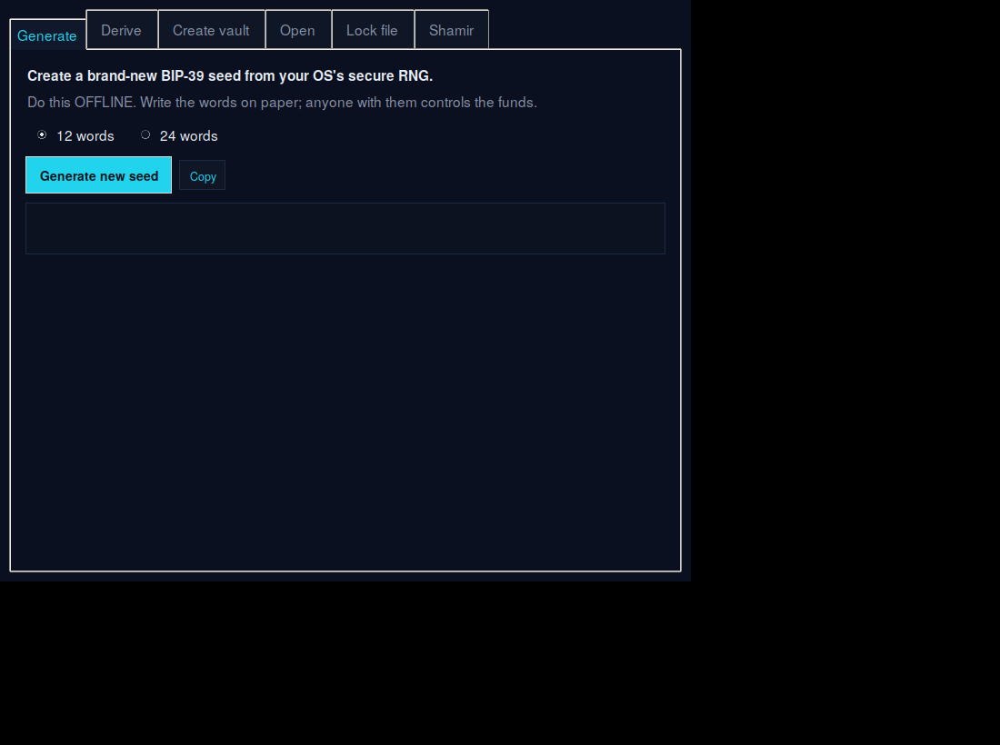</td>
    <td>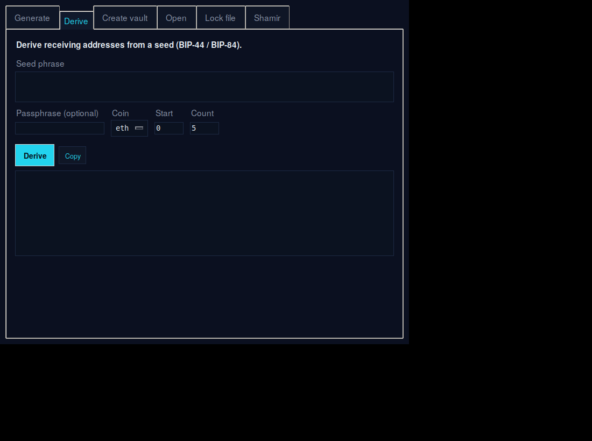</td>
    <td>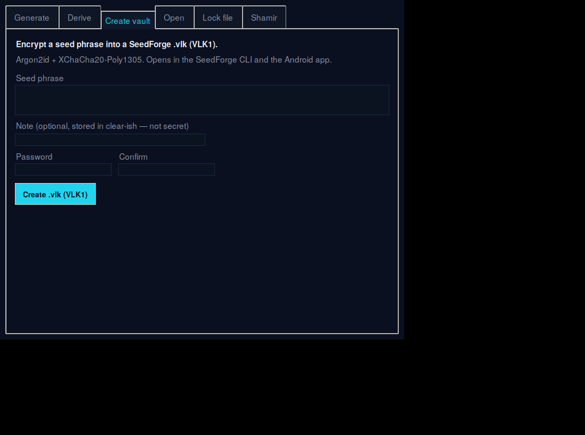</td>
  </tr>
  <tr>
    <td align="center"><b>Open any <code>.vlk</code></b></td>
    <td align="center"><b>Lock a file</b></td>
    <td align="center"><b>Shamir split / combine</b></td>
  </tr>
  <tr>
    <td>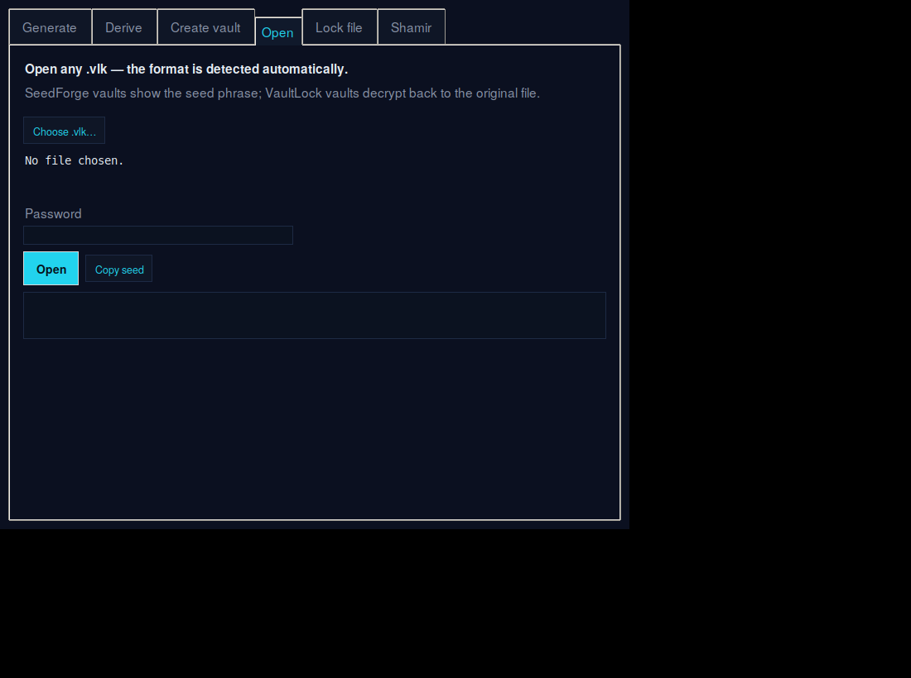</td>
    <td>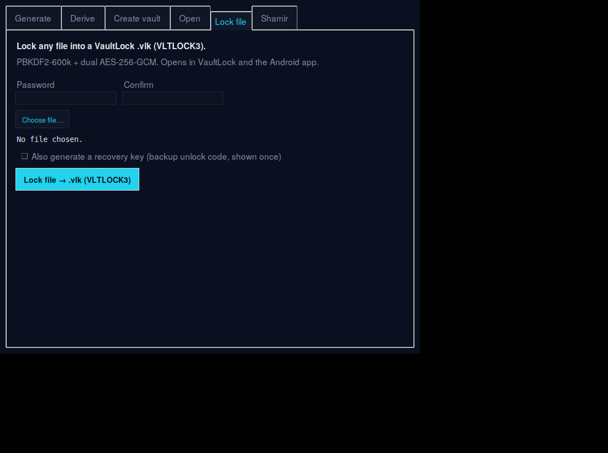</td>
    <td>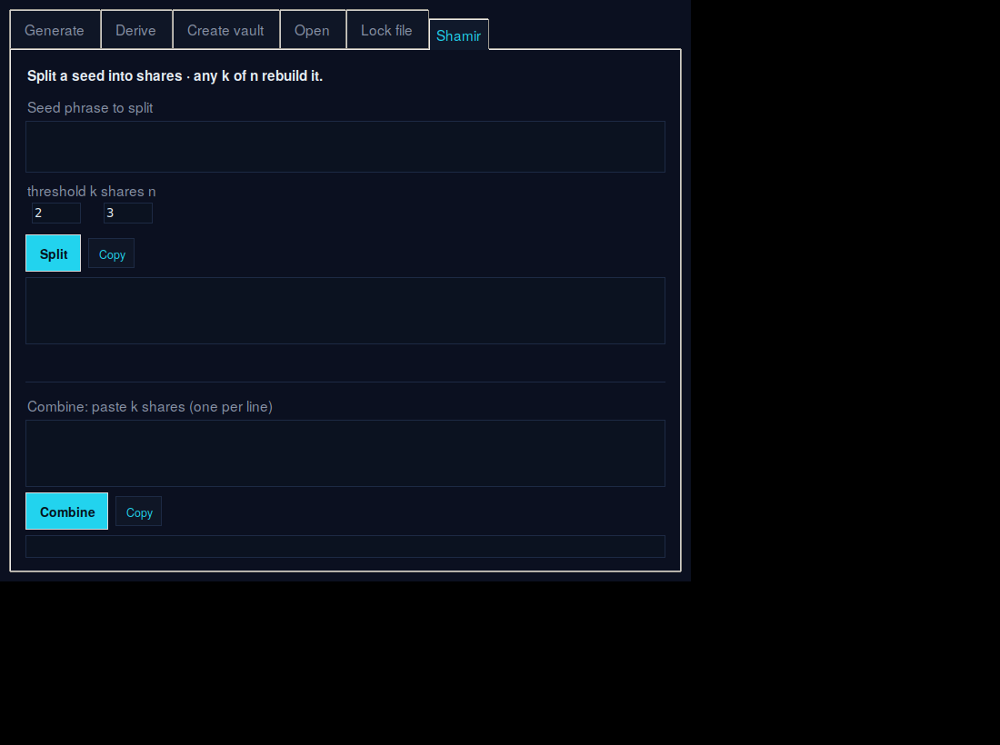</td>
  </tr>
</table>

### Android

<table>
  <tr>
    <td align="center"><b>Generate</b></td>
    <td align="center"><b>Derive</b></td>
    <td align="center"><b>Create vault</b></td>
  </tr>
  <tr>
    <td>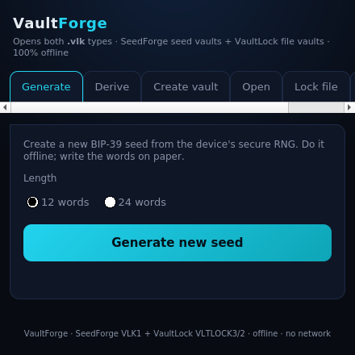</td>
    <td>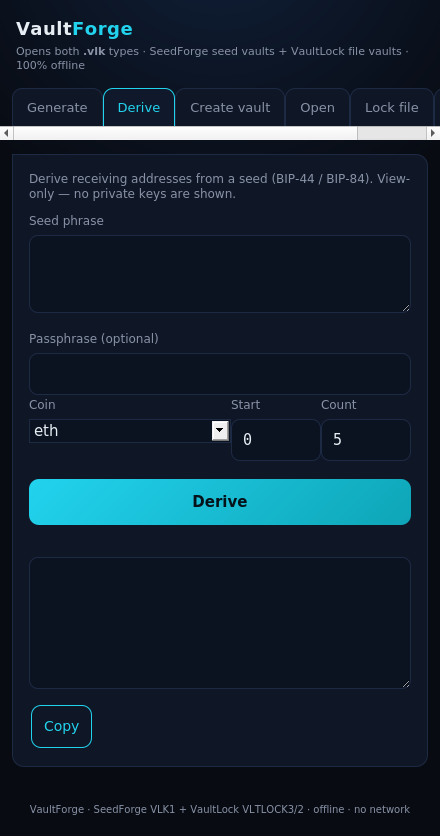</td>
    <td>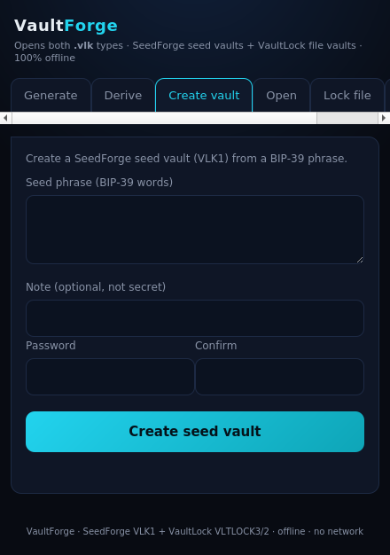</td>
  </tr>
  <tr>
    <td align="center"><b>Open</b></td>
    <td align="center"><b>Lock file</b></td>
    <td align="center"><b>Shamir</b></td>
  </tr>
  <tr>
    <td>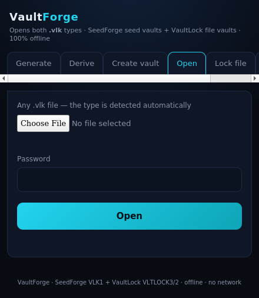</td>
    <td>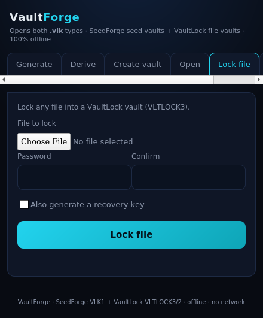</td>
    <td>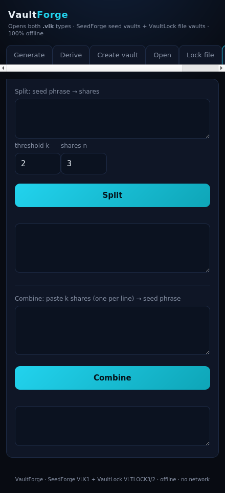</td>
  </tr>
</table>

---

## Quick start

| You want to… | Use | How |
|---|---|---|
| A no-frills, dependency-free generator | `SeedForge` binary / `SeedForge.apk` | double-click / install |
| A GUI to generate, derive, and manage vaults | `VaultForge_Desktop.py` | run with `VaultForge.bat` / `VaultForge.sh` |
| The same GUI on a phone | `VaultForge.apk` | sideload |
| The GUI without installing anything | `VaultForge_Android.html` | open in any browser |
| Scriptable HD derivation / multisig | `SeedForge-Wallet` binary | command line |

**Do it offline.** A spare laptop in airplane mode or a live-USB Linux session is ideal.
Write the words on paper (or stamp them into metal); never type them into a website,
wallet import box, chat, cloud note, or photo.

---

## VaultForge — the GUI apps

One app, three surfaces (desktop / Android / browser), all with the same six tabs:

| Tab | What it does |
|---|---|
| **Generate** | New 12- or 24-word BIP-39 seed from the OS secure RNG, with the raw entropy shown. |
| **Derive** | Seed (+ optional passphrase) → **ETH**, **BTC-legacy**, and **BTC-segwit** addresses. View-only — private keys are never displayed. |
| **Create vault** | Encrypt a seed phrase into a SeedForge `.vlk` (VLK1). |
| **Open** | Open **any** `.vlk`; the format is auto-detected. Seed vaults reveal the phrase; VaultLock vaults decrypt back to the original file (password **or** recovery key). |
| **Lock file** | Encrypt any file into a VaultLock `.vlk` (VLTLOCK3), with an optional recovery key. |
| **Shamir** | Split a seed into `k`-of-`n` shares and recombine them. |

### Run the desktop GUI
Needs **Python 3** (with Tkinter). On first run it auto-installs three PyPI packages
(`pynacl`, `argon2-cffi`, `cryptography`) — all ship as prebuilt wheels, so no compiler
is needed.

- **Windows:** double-click **`VaultForge.bat`** (Python from [python.org] includes Tkinter).
- **Linux/macOS:** `./VaultForge.sh` — on Debian/Ubuntu first run `sudo apt install python3-tk`.
- Or directly: `python3 VaultForge_Desktop.py`

> **Airgap note:** that one-time `pip install` is the *only* time the desktop GUI touches
> the network. For a fully offline machine, pre-install the three packages, or use the
> dependency-free `SeedForge` generator instead.

### Run the Android GUI
Copy **`VaultForge.apk`** to the phone and open it; allow "install from unknown sources"
for your file manager. It declares **no permissions** — verify with
`aapt dump permissions VaultForge.apk` (output: none). Decrypted files are saved to
`Downloads/VaultForge/`. Put the phone in airplane mode first as good practice.

### Run it in a browser
Open **`VaultForge_Android.html`** in any modern browser — it's the same app as a single
self-contained page (no network requests, works from `file://`). Handy on a desktop when
you'd rather not sideload an APK.

*(`VaultForge_Windows.py` is the earlier single-format GUI, kept for reference;
`VaultForge_Desktop.py` supersedes it with Generate, Derive, and dual-format open.)*

---

## Vault formats & interop

VaultForge speaks two on-disk `.vlk` formats and auto-detects which one you hand it:

- **SeedForge `VLK1`** — wraps a **seed phrase**. Argon2id (t=3, 128 MiB, 4 lanes) →
  XChaCha20-Poly1305 with the full header authenticated as AAD (tamper-evident,
  non-downgradable). Full spec in [`VAULT_FORMAT.md`](VAULT_FORMAT.md). A vault made in the
  GUI opens in the `SeedForge-Wallet` CLI and vice-versa.
- **VaultLock `VLTLOCK3`** (and legacy `VLTLOCK2`) — wraps an **arbitrary file**.
  PBKDF2-HMAC-SHA256 (600k) wraps a random master key, which is split via HKDF-SHA256 into
  two independent **AES-256-GCM** layers over the data; an optional recovery key is a second
  wrap of the same master key. Files created here open in VaultLock's own app, and files from
  VaultLock open here — byte-for-byte, both directions.

So the same app can recover a seed vault, decrypt a locked file, and create either.

---

## Why this is secure

Security here is a set of properties you can check yourself, not a slogan.

1. **It cannot reach the network — by construction.**
   - *SeedForge (Go):* the source imports no `net` package —
     `go list -deps ./src/desktop | grep net` returns nothing. A binary that never links a
     socket API can't phone home.
   - *Android (both apps):* the manifest requests **zero permissions**, in particular no
     `INTERNET`; the sandbox then physically forbids opening a socket. Verify with
     `aapt dump permissions <app>.apk` (output: none).
   - *VaultForge web/desktop:* no `fetch`, `XMLHttpRequest`, or `WebSocket` anywhere (grep
     the HTML); the desktop GUI's only network use is the one-time dependency install noted above.

2. **Real randomness.** Entropy comes only from the OS CSPRNG
   (`crypto/rand` → `getrandom(2)`/`BCryptGenRandom`; `SecureRandom` / `crypto.getRandomValues`
   on Android/web). On the CLI you can optionally fold in your own dice rolls / coin flips.

3. **Nothing is stored.** No logs, no telemetry, no clipboard writes unless you press "Copy".
   The SeedForge generator writes no files at all; VaultForge only writes the files you
   explicitly save. On Android the generator uses `FLAG_SECURE` to block screenshots and the
   recent-apps thumbnail.

4. **The wordlist can't be swapped.** The official 2048-word BIP-39 English list is embedded and
   its SHA-256 (`2f5eed53a4727b4bf8880d8f3f199efc90e58503646d9ff8eff3a2ed3b24dbda`) is checked at
   startup; a tampered build refuses to run.

5. **Provably correct.** Every implementation is validated against the official BIP-39 / Trezor
   test vectors — `SeedForge -selftest` on the CLI, and every VaultForge address matches the Go
   wallet byte-for-byte (including the passphrase case). Wrong math fails the check.

6. **Minimal trust surface.** The generator pulls in **nothing** beyond the Go standard library.
   VaultForge deliberately leans on *vetted* primitives instead of rolling its own crypto
   (`x/crypto` / `@noble` / `@scure` / StableLib / PyNaCl / `cryptography`), where a homemade
   secp256k1 or AES-GCM would be reckless.

**What no generator can protect against — read this.** A compromised operating system beats
everything: keyloggers, screen recorders, RAM scrapers, malicious drivers, and
shoulder-surfers / cameras are all outside its control. For anything holding real value, run on
a clean, offline machine; write the words on paper or metal; and keep two copies in separate
secure places. See [`SECURITY.md`](SECURITY.md) for the full threat model.

---

## SeedForge — the offline generator

Two independent, auditable BIP-39 generators that share nothing but the algorithm — a Go
console binary (Windows/macOS/Linux) and a pure-Java Android APK with **no HTML, JS, web layer,
or network code anywhere**.

### Run it
- **Windows:** double-click `SeedForge-windows-amd64.exe` (`-arm64` on ARM). SmartScreen may
  warn because it isn't purchased-code-signed → *More info → Run anyway*, or build it yourself.
- **macOS:** `chmod +x SeedForge-macos-arm64 && ./SeedForge-macos-arm64` (Gatekeeper: *Open
  Anyway*, or `xattr -d com.apple.quarantine ./SeedForge-macos-arm64`).
- **Linux:** `chmod +x SeedForge-linux-amd64 && ./SeedForge-linux-amd64`
- **Android:** install `SeedForge.apk` (airplane mode first; it has no network permission regardless).

### CLI flags
```
SeedForge -words 24               # print a 24-word phrase and exit
SeedForge -words 12 -entropy      # also show the raw entropy hex
SeedForge -words 24 -seed         # also derive the 64-byte BIP-39 seed
SeedForge -extra "5 3 6 1 dice"   # fold your own entropy into the OS randomness
SeedForge -passphrase "..." -seed # 25th-word passphrase affects the seed
SeedForge -verify "word1 ... word12"   # validate an existing phrase
SeedForge -selftest               # run BIP-39 test vectors and exit
```
Word counts → entropy: `12→128-bit, 15→160, 18→192, 21→224, 24→256`.

**Extra entropy (optional).** If you don't fully trust the machine's RNG, add your own:
the tool computes `entropy = SHA-512(os_random ‖ your_input)`. Because SHA-512 is a strong mixer,
the result is unpredictable if **either** source is — a backdoored OS RNG can't determine your
phrase, and weak human input can't weaken a good OS RNG.

---

## SeedForge Wallet — CLI

A **separate binary** (`SeedForge-Wallet-*`) turns a mnemonic into addresses and provides two
backup mechanisms. Kept separate so the generator stays dependency-free while this tool uses the
vetted `btcec` secp256k1 and `x/crypto`. **No network code** — secrets only ever print to your
local terminal, and only when you ask. Run `SeedForge-Wallet selftest` to see BIP-32, BIP-44/84,
ETH, BTC, Shamir, and the vault all verified at once.

### Derive addresses (BIP-44 / BIP-84)
```bash
SeedForge-Wallet derive -mnemonic "word1 ... word24" -coin eth -count 5
SeedForge-Wallet derive -mnemonic "..." -coin btc-segwit         # bc1...  (BIP-84)
SeedForge-Wallet derive -mnemonic "..." -coin btc                # 1...    legacy (BIP-44)
# add -show-secret to also print private keys / WIF (only on a screen nobody sees)
```

### Backup A — encrypted `.vlk` vault
```bash
SeedForge-Wallet vault-create -mnemonic "..." -note "cold storage" -out backup.vlk
SeedForge-Wallet vault-inspect -in backup.vlk     # KDF params, no password needed
SeedForge-Wallet vault-open    -in backup.vlk     # prompts for password, prints phrase
```

### Backup B — Shamir k-of-n split
```bash
SeedForge-Wallet split -mnemonic "..." -threshold 3 -shares 5
# later, with any 3 shares:
SeedForge-Wallet combine -share "seedforge-shamir-v1:3:1:..." -share "...:3:4:..." -share "...:3:5:..."
```
Each share carries a checksum, so a mistyped share is rejected rather than silently
reconstructing the wrong secret. (A documented plain split, not SLIP-39 — round-trips only with
this tool and VaultForge.)

### Offline multisig (Bitcoin k-of-n)
A multisig wallet is defined by **public** keys, so it's built entirely offline: each cosigner
generates a seed on their own airgapped device and shares only an account **xpub** — no private
key ever meets.
```bash
# 1) On EACH signer's offline machine — export the account xpub (never the seed):
SeedForge-Wallet xpub -mnemonic "signer's words..."
# 2) On the coordinator machine — combine xpubs into 2-of-3 addresses:
SeedForge-Wallet multisig -threshold 2 -script wsh \
  -xpub "xpubAAA..." -xpub "xpubBBB..." -xpub "xpubCCC..." -count 5
```
`-script`: `wsh` native segwit (`bc1q…`, recommended), `sh` legacy (`3…`), or `sh-wsh` wrapped
segwit. Keys are BIP-67 sorted so cosigners derive identical addresses regardless of order; the
command also prints a checksummed output descriptor to import into Sparrow / Bitcoin Core /
Electrum and confirm the addresses match.

> Ethereum "multisig" is a smart contract (e.g. Safe), not offline key derivation, so it is
> intentionally out of scope.

---

## Build from source

Building yourself is the strongest guarantee.

**SeedForge generator (needs only Go):**
```bash
cd src/desktop
go run . -selftest      # confirm the vectors pass
bash build.sh           # cross-compiles Windows/macOS/Linux into ./out
```

**SeedForge Wallet (Go + network once for pinned deps):**
```bash
cd src/wallet
go run . selftest
go build -o SeedForge-Wallet .
```

**SeedForge Android (JDK + Android SDK build-tools, no Gradle/Studio):**
```bash
sdkmanager "platform-tools" "platforms;android-34" "build-tools;34.0.0"
cd src/android
ANDROID_HOME=/path/to/android-sdk JAVA_HOME=/path/to/jdk bash build.sh   # -> build/SeedForge.apk
```

**VaultForge:** the desktop app is just `VaultForge_Desktop.py` (no build step). The Android
`VaultForge.apk` is a zero-permission WebView wrapper around `VaultForge_Android.html`, built
with raw `aapt2` / `javac` / `d8` / `apksigner` (no Gradle). Bundled APKs are signed with a
throwaway project key purely so they install — **not** a trusted identity; rebuild with your own
key for your own copy.

---

## Verify your download

Every shipped artifact is listed in [`SHA256SUMS.txt`](SHA256SUMS.txt).
```bash
# Linux/macOS
sha256sum -c SHA256SUMS.txt
# Windows (PowerShell), per file:
Get-FileHash .\VaultForge.apk -Algorithm SHA256
```
After adding or rebuilding files, regenerate it: `sha256sum <files...> > SHA256SUMS.txt`.

---

## Repository layout
```
Offline-cold-storage-wallet/
├── README.md                     this file
├── SECURITY.md                   full threat model & verification steps
├── VAULT_FORMAT.md               the .vlk (VLK1) container spec
├── SHA256SUMS.txt                checksums for every shipped artifact
├── LICENSE                       MIT
├── .gitignore                    blocks seeds/keys/vaults from being committed
├── docs/                         screenshots used by this README
│
│   ── SeedForge (generator + CLI) ──
├── SeedForge.apk                 offline BIP-39 generator (pure Java, 0 permissions)
├── SeedForge-Wallet-windows-amd64.exe   HD wallet CLI (Windows)
├── bin/                          all prebuilt binaries (generator + wallet, every OS) + SeedForge.apk
├── src/desktop/                  generator — Go (main.go, bip39.go) + build.sh
├── src/android/                  generator — Java, manifest, res, assets + build.sh
├── src/wallet/                   HD derivation, multisig & backup — Go + go.sum
├── wordlist/                     official BIP-39 English list + its SHA-256
│
│   ── VaultForge (GUI apps) ──
├── VaultForge_Desktop.py         desktop GUI (Win/Linux/macOS) — generate, derive, both .vlk formats, Shamir
├── VaultForge.bat / VaultForge.sh   launchers for the desktop GUI
├── VaultForge.apk                Android GUI (WebView, 0 permissions)
├── VaultForge_Android.html       the same GUI as a self-contained web page
└── VaultForge_Windows.py         earlier single-format GUI (superseded by VaultForge_Desktop.py)
```

---

## Publishing / cutting a release

The included `.gitignore` blocks the dangerous stuff — `*.vlk`, anything named like a
seed/mnemonic/share, `*.wif`/`*.key`, and Android `*.keystore`/`*.jks`. **Check `git status`
before every push and never commit a real seed, share, vault, or signing key.**

### Push the source
```bash
git add .
git status                       # confirm NO seeds/keys/.vlk are staged
git commit -m "SeedForge + VaultForge: offline cold-storage wallet"
git push
```

### Attach the binaries/APKs as a Release
Big binaries bloat git history — publish them as a GitHub **Release** instead.

**Using the GitHub CLI (`gh`)** — note `gh` is a separate tool you must install first:
```bash
# install once:  Windows: winget install GitHub.CLI   ·   macOS: brew install gh   ·   Linux: apt install gh
gh auth login
gh release create v1.0.0 ^
  VaultForge.apk VaultForge_Desktop.py VaultForge_Android.html ^
  SeedForge.apk bin/SeedForge-Wallet-* bin/SeedForge-* ^
  -t "SeedForge v1.0.0" -n "Offline BIP-39 generator + HD wallet (multisig, .vlk vault, Shamir) + VaultForge GUIs"
```
*(`^` continues a line in Windows `cmd`; use `\` in bash/PowerShell. The
`'-t' is not recognized` error means `gh` wasn't installed / on PATH — install it, reopen the
terminal, and re-run.)*

**Prefer the web UI?** On the repo page: **Releases → Draft a new release → choose a tag →**
drag the `.apk` / `.exe` / `.py` files into "Attach binaries" → **Publish**. No CLI required.

---

## Credits

Built by **@speedevs**. BIP-39 by M. Palatinus, P. Rusnak, A. Voisine, S. Bowe.
secp256k1 via `btcec` / `@noble/curves`; Argon2id & XChaCha20-Poly1305 via `golang.org/x/crypto`,
PyNaCl, and StableLib; VaultLock `.vlk` interop with the companion
[Vault-lock-encryption-final-boss-](https://github.com/Speedevs/Vault-lock-encryption-final-boss-) project.

MIT licensed. Use at your own risk — this software holds keys to real money and comes with no warranty.

[python.org]: https://www.python.org/downloads/
